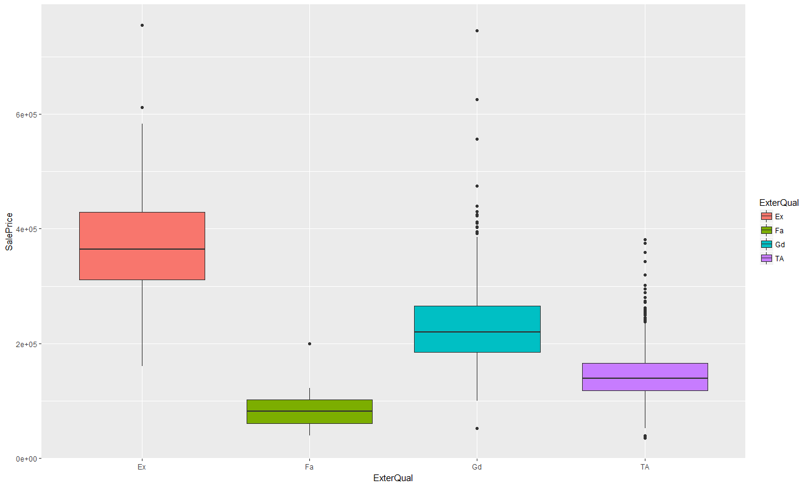
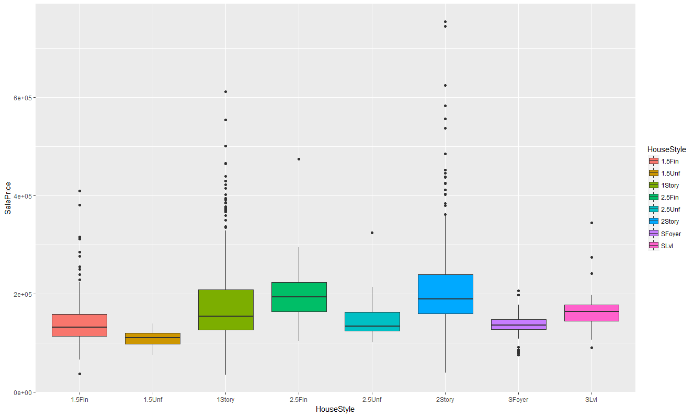
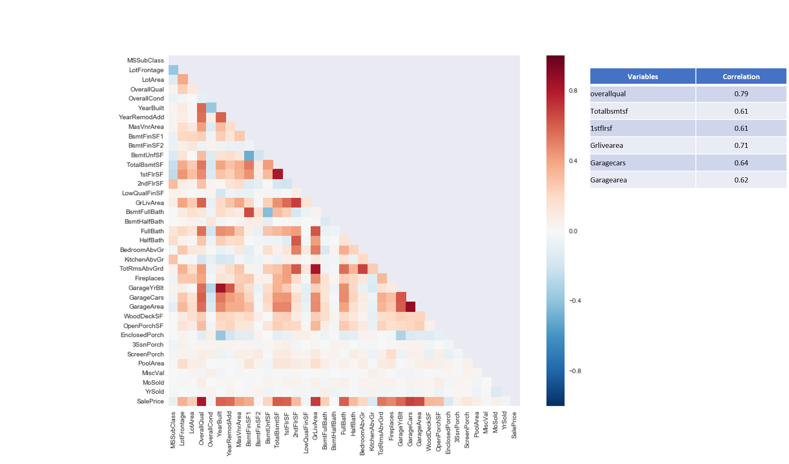
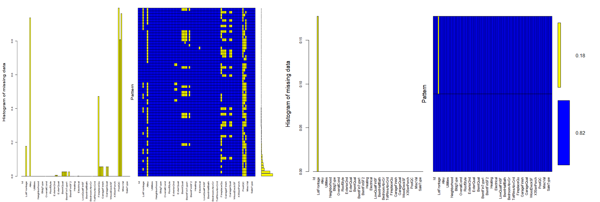
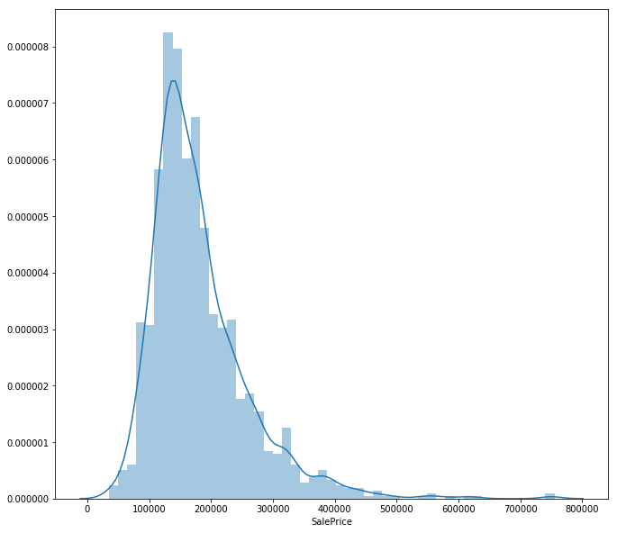
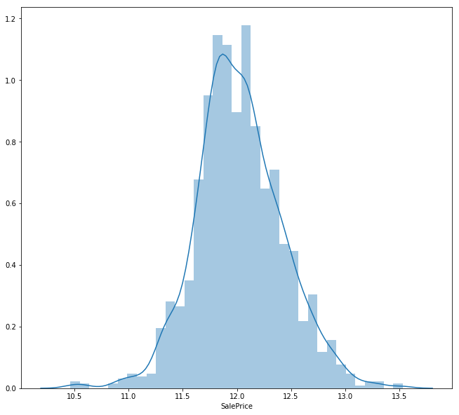
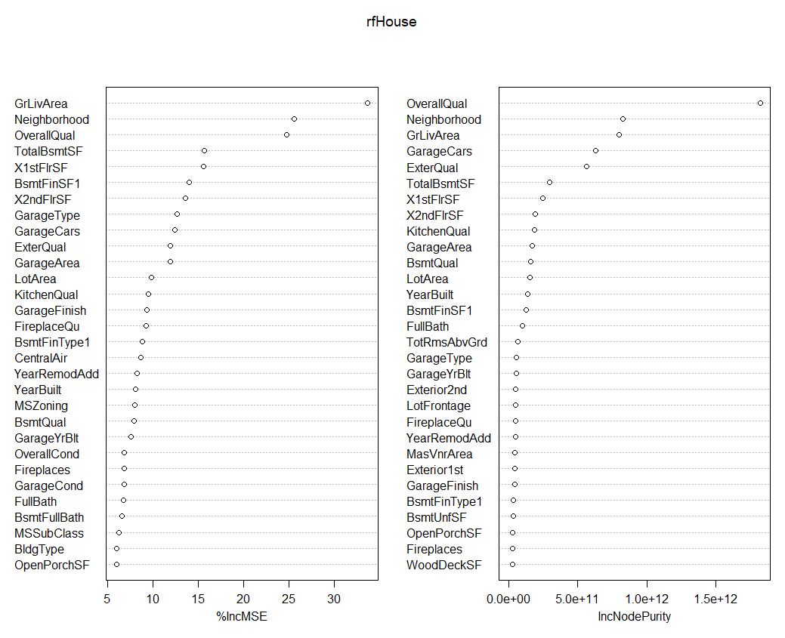
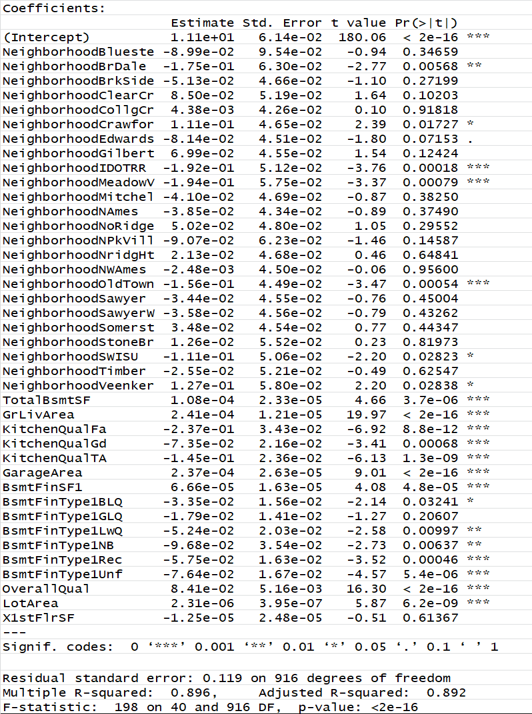
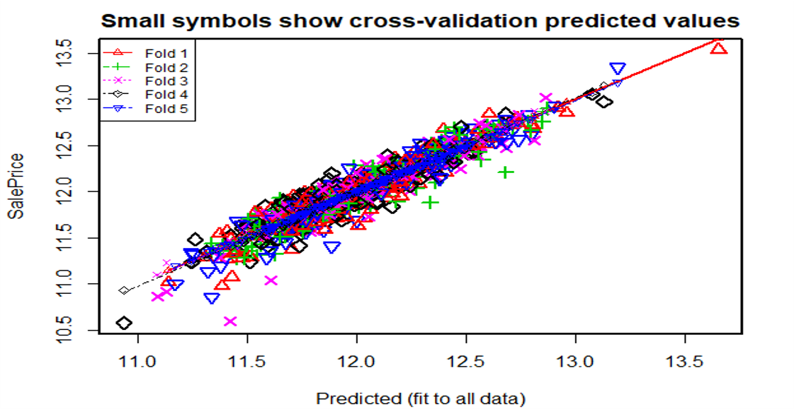

## Machine Learning Project
As part of the Kaggle competition, worked with a team utilizing multiple linear regression with regularization, random forests to create a predictive model for Ames Housing prices using R.

#### Data 
Project aims at predicting house prices (REsidential) in Ames, IOWA, USA based on data provided by kaglle between 2006 and 2010. The dataset contains 1460 observations in the training set and 1459 observations in the test set. There are 46 categorical variables including 23 nominal and 23 rdinal ones, and 33 numeriv variables in the dataset. The training set has the sale price as repsonse variable.

### Data Visualizations

#### Qualitative vs Sale Price
<table>
  <tr>
    <td> </td>
    <td></td>
   </tr> 
   <tr>
      <td></td>
      <td>
  </td>
  </tr>
</table>

#### Correlation

### Data Pre-Processing
##### Missing Values

 
##### Mice Imputations

 #### Pre-Processing

 * hi
 * hi
 * hi
<table>
  <tr>
    <td> </td>
    <td></td>
   </tr>
 </table>

### Features Engineering

### Model Training & Evaluation
##### Summary Statistics

##### Cross Validation

